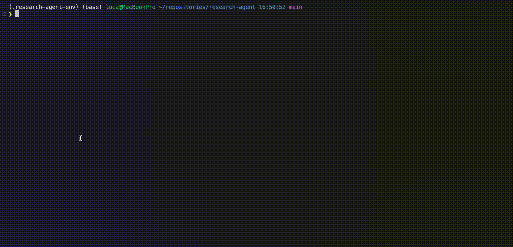

# Conversational Research Agent with Dynamic Knowledge Base



## Overview

This project implements a conversational AI research assistant that can interact with a local collection of research papers. Users can ask questions about the papers, and the agent uses a Retrieval Augmented Generation (RAG) approach with an Anthropic Claude model to provide answers grounded in the document content.

A key feature is the agent's ability to dynamically expand its knowledge base: users can instruct the agent to search for new papers on arXiv, download them, process them, and integrate them into its vector store for immediate querying. The agent also maintains conversational context, allowing for follow-up questions, recalling parts of the conversation, and a more natural interaction flow. It can also fetch and suggest recent papers based on user-specified areas of interest.

## Features

* **Conversational Interface:** Interacts with users in a chat-like manner.
* **Persistent Chat History:** Remembers the context of the conversation across sessions, including automatic summarization of older parts of the dialogue to maintain long-term context efficiently.
* **Meta-Conversational Awareness:** Can answer questions about the ongoing conversation itself (e.g., "What was my last question?").
* **Retrieval Augmented Generation (RAG):** Answers questions based on content retrieved from a local collection of PDF research papers.
* **Dynamic Knowledge Base Expansion:**
    * Searches for papers on arXiv based on user queries (titles, keywords, arXiv IDs) using the `/add_paper` command.
    * Allows user selection if multiple papers are found.
    * Downloads selected PDFs into a local directory.
    * Processes new PDFs (text extraction, chunking, embedding).
    * Updates the vector store (FAISS index and text chunk metadata) in real-time.
* **Stay Updated:** Fetches and lists recent papers from arXiv based on a research area using the `/stay_updated` command, allowing users to select papers for download and integration.
* **List Indexed Papers:** Users can view a list of all papers currently loaded into the knowledge base with the `/list_papers` command.
* **Persistent Storage:** Downloaded papers, the vector store, and chat history are saved locally.
* **Modular Design:** Code is organized into separate modules for paper management, vector store operations, and the main agent logic.

## Tech Stack & Key Libraries

* **Python 3.x**
* **Anthropic API:** For Large Language Model (Claude) capabilities (e.g., `claude-3-5-haiku-20241022`).
* **Sentence-Transformers:** For generating text embeddings (e.g., `all-MiniLM-L6-v2`).
* **FAISS (cpu):** For efficient similarity search in the vector store.
* **pypdf:** For extracting text from PDF documents.
* **arXiv:** Python library for searching and retrieving metadata from arXiv.
* **NLTK:** For sentence tokenization.
* **python-dotenv:** For managing API keys.
* **NumPy:** For numerical operations.
* **Requests:** For downloading papers.
* **(Optional for development) Black:** For code formatting.

## Setup and Installation

1.  **Clone the Repository (or set up project directory):**
    If this were a Git repository:
    ```bash
    git clone <your-repository-url>
    cd <repository-name>
    ```
    Otherwise, ensure all the Python files (`research_agent.py`, `paper_manager.py`, `vector_store_manager.py`, `bulk_download_papers.py`), `create_env.sh`, and `initial_papers.json` are in your main project directory.

2.  **Set up Python Virtual Environment:**
    Make the setup script executable and run it:
    ```bash
    chmod +x create_env.sh
    ./create_env.sh
    ```
    This will create a virtual environment named `.research-agent-env`.

3.  **Activate the Virtual Environment:**
    ```bash
    source .research-agent-env/bin/activate
    ```
    (On Windows, it might be `.research-agent-env\Scripts\activate`)

4.  **Install Dependencies:**
    ```bash
    pip install -r requirements.txt
    ```

5.  **Set up Environment Variables:**
    Create a `.env` file in the project root:
    ```
    ANTHROPIC_API_KEY="your_anthropic_api_key_here"
    ```
    Replace `"your_anthropic_api_key_here"` with your actual Anthropic API key.

6.  **Download NLTK 'punkt' Tokenizer Data:**
    The scripts attempt to download this automatically if missing. If you encounter issues, you can do it manually after activating the environment:
    ```bash
    python -c "import nltk; nltk.download('punkt')"
    ```

## Running the Application

Follow these steps in order:

1.  **Step 1: Initial Paper Download (Optional, but Recommended for a starting knowledge base)**
    This script uses `initial_papers.json` to download a predefined set of papers.
    ```bash
    python bulk_download_papers.py
    ```
    This will populate the `research_papers/` directory.

2.  **Step 2: Initial Vector Store Build**
    This script processes all PDFs in the `research_papers/` directory and creates the FAISS index and text chunk metadata.
    ```bash
    python vector_store_manager.py
    ```
    This will create and populate the `vector_store/` directory.

3.  **Step 3: Run the Research Agent**
    Start the interactive agent:
    ```bash
    python research_agent.py
    ```
    The agent will load any existing chat history from `chat_history.json`.

## Usage

Once the agent is running, you can interact with it via the command line:

* **Asking Questions about Papers:** Simply type your question about the content of the ingested research papers and press Enter.
    Example: `What is the main idea behind the Transformer architecture?`

* **Asking Meta-Conversational Questions:** You can ask about the ongoing chat.
    Example: `What was my last question?`
    Example: `What did you say about RAG earlier?`

* **Available Commands:**
    * `/help`: Display the help message.
    * `/add_paper <title/keywords/arXiv ID>`: Search for a specific paper on arXiv, then optionally download and add it.
        Example: `/add_paper Retentive Network A Successor to Transformer`
        Example: `/add_paper 2305.10601`
    * `/stay_updated <area/keywords>`: Fetch a list of recent papers (last ~90 days) from arXiv for a research area. You can then select papers to download and add.
        Example: `/stay_updated large language models`
    * `/list_papers`: List all papers currently loaded in the knowledge base.
    * `/clear_history`: Clear the chat conversation history (memory & persistent file).
    * `/quit` or `/exit`: Exit the Research Agent Assistant (saves chat history).

## Configuration Notes

* **LLM Model:** The Anthropic model used for Q&A (`LLM_MODEL_NAME`) and summarization (`SUMMARIZER_MODEL_NAME`) can be changed in `research_agent.py` (default: `claude-3-5-haiku-20241022`).
* **Embedding Model:** The sentence transformer model is set in `research_agent.py` and `vector_store_manager.py` (`EMBEDDING_MODEL_NAME`, default: `all-MiniLM-L6-v2`). Ensure it's consistent.
* **Top-K Retrieval:** The number of chunks retrieved for RAG context can be adjusted via `TOP_K_RESULTS` in `research_agent.py` (default: 5).
* **Chat History Summarization:**
    * `SUMMARIZATION_TRIGGER_COUNT`: Number of total messages before summarization is triggered (default: 12).
    * `MESSAGES_TO_KEEP_RAW_AFTER_SUMMARY`: Number of latest raw messages preserved after a summarization event (default: 4).
    * `MAX_SUMMARY_TOKENS`: Max tokens for the generated summary (default: 350).
* **Paper Download Directory:** Papers are downloaded to the `research_papers` directory, as defined by `PAPERS_DIR` in `paper_manager.py`, `bulk_download_papers.py`, and `vector_store_manager.py`.
* **Vector Store Directory:** The FAISS index and chunk data are stored in the `vector_store` directory, as defined by `VECTOR_STORE_DIR` in `research_agent.py` and `vector_store_manager.py`.
* **Stay Updated Feature:**
    * `NUM_RECENT_PAPERS_TO_DISPLAY`: Number of recent papers to show from the `/stay_updated` command (default: 7).
    * `DAYS_RECENT_THRESHOLD`: How many days back to consider papers as "recent" (default: 90).

## Notes & Troubleshooting

* **TOKENIZERS_PARALLELISM Warning:** You might see a warning like:
    ```
    huggingface/tokenizers: The current process just got forked, after parallelism has already been used. Disabling parallelism to avoid deadlocks...
    To disable this warning, you can either:
            - Avoid using `tokenizers` before the fork if possible
            - Explicitly set the environment variable TOKENIZERS_PARALLELISM=(true | false)
    ```
    This is from the Hugging Face `tokenizers` library (used by `sentence-transformers`). It generally doesn't affect functionality. To suppress it, you can set the environment variable before running the script:
    ```bash
    export TOKENIZERS_PARALLELISM=false
    python research_agent.py
    ```
    Or add `import os; os.environ["TOKENIZERS_PARALLELISM"] = "false"` at the beginning of `research_agent.py`.

## Potential Future Enhancements

* **Advanced Chat Memory:** More nuanced summarization strategies or tiered memory.
* **Support for More Document Types:** Extend beyond PDFs (e.g., .txt, .md, .docx).
* **Graphical User Interface (GUI):** Using Streamlit or Gradio.
* **Improved RAG:** Techniques like re-ranking retrieved chunks, query expansion, or hybrid search.
* **Citation Analysis:** Functionality to analyze and answer questions about citation patterns within the local corpus.
* **Error Handling:** More comprehensive error handling for file operations, API calls, and library interactions.